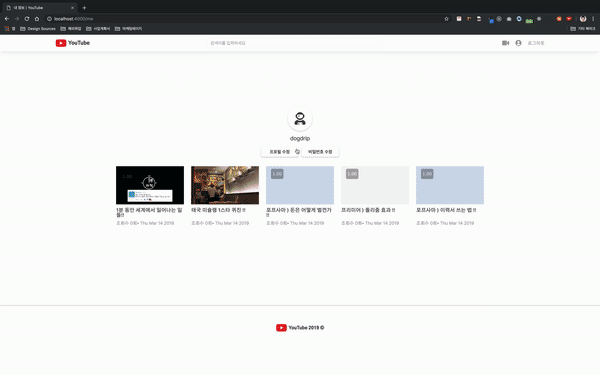
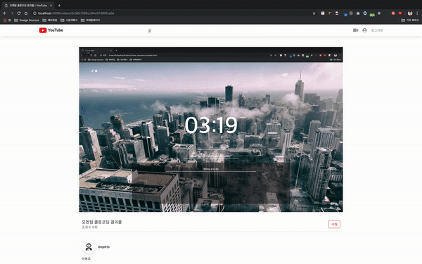

# **Clone_youtube**

Cloning Youtube with Vanilla and Node JS

**메인페이지 & 비디오 보기**
>

**프로필**
>

**검색**
>

**화면녹화**
>

## Structure

### Global
- 홈 (Home)
- 회원가입 (Signup)
- 로그인 (Login)
- 로그아웃 (Logout)
- 검색 (Search)

### Users
- 유저 정보 (User Detail)
- 유저 프로필 수정 (Edit Profile)
- 비밀번호 변경 (Change Password)

### Videos
- 동영상 업로드 (Upload Video)
- 동영상 수정 (Edit Video)
- 동영상 삭제 (Delete Video)

## DB
- MongoAtlas
- AWS s3
